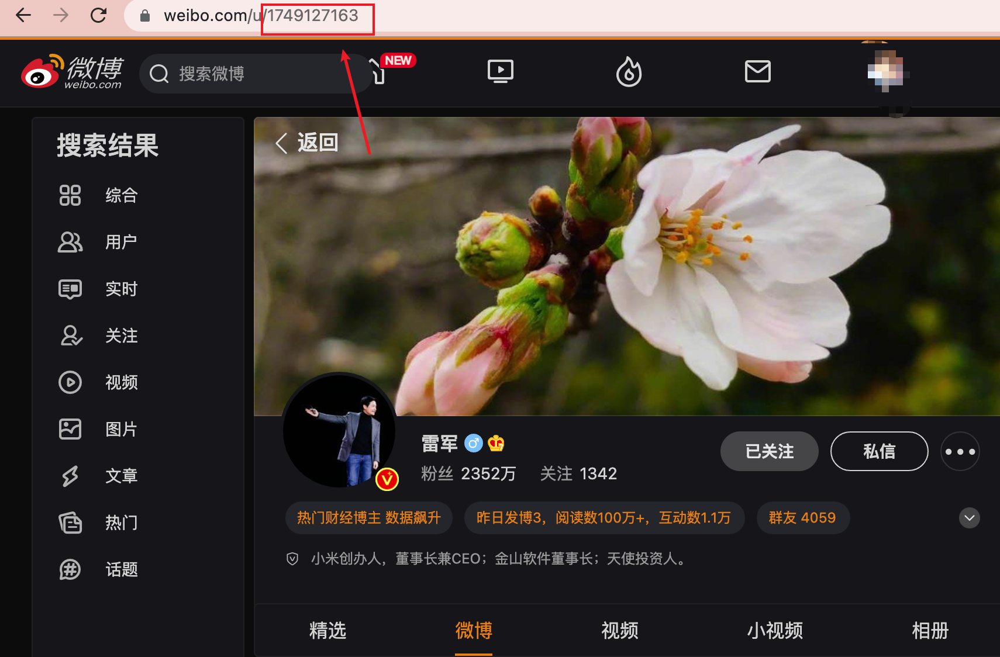
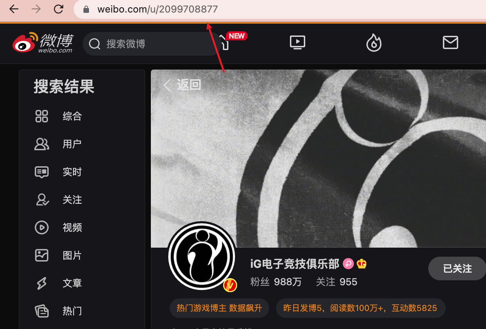

# WBMonitor
## Usage

1. Fork [this responsitory](https://github.com/0Chencc/WBMonitor)
2. Create 'Server酱' [SCKEY](http://sc.ftqq.com/?c=code)
3. In project page, click 'Settings' -> click 'Secret'
4. In 'Secret' page, create two secrets named 'USER_INFO' and 'PUSH_KEY':
   - 'PUSH_KEY': SCKEY
   - 'WB_USERIDS':wbUserId,wbUserId2
     >Exmple:WB_USERIDS=2099708877,1749127163
     
   
   
    
    